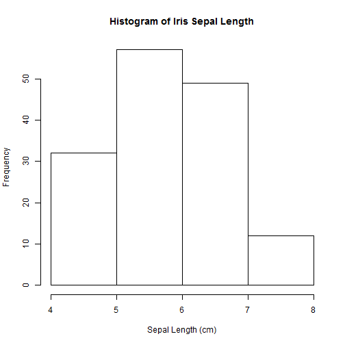
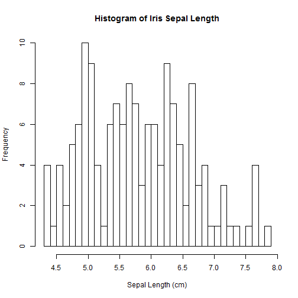

dp_classProj
========================================================
author: jwismer
date: 11/21/2015
## Iris Sepal Length Distribution

Introduction
========================================================

This Shiny Application uses a histogram display to help
the user visualize the characteristics of the distribution
in Sepal Length within the Iris dataset available in R.

### Tool Features:
- User controlled bucket size
- Reactive display of the histogram

Histogram Basics
========================================================

### The number of buckets can hide detail

 

This histogram has 5 buckets and therefore it is difficult to see detail
or variation in the sepal length in the Iris dataset.

Histogram Basics
========================================================

### There is a balance though.

Sometimes to much detail introduces noise.

 

This histogram has 28 buckets and it is easy to see
variation in the sepal length.

The Shiny App
========================================================

### Click the link below to access the tool on the ShinyApp.io server

[Shiny App Tool](https://jwismer.shinyapps.io/DataProducts_ClassProj)

Use the slider to manipulate the number of buckets.

Notice that more detail is revealed as the number of buckets is increased.
